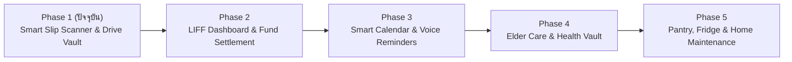

# 🗺 ROADMAP: KonGlom-homeservice (แผนงานเวอร์ชันอนาคต)

เอกสารนี้ระบุวิสัยทัศน์และการพัฒนาต่อยอดของ **KonGlom-homeservice** จากระบบบันทึกสลิป ไปสู่ **"แพลตฟอร์มศูนย์รวมการดูแลบ้านและครอบครัวแบบครบวงจร"**

---

## 📈 แผนภาพ Roadmap ทั้งหมด

---

## 📊 Phase 2: Family LIFF Dashboard & ระบบเคลียร์เงินกองกลาง

> **ธีม:** มองเห็นภาพรวมการเงิน และช่วยเคลียร์เงินกองกลางแบบไม่ต้องคิดเลขเอง

### ฟีเจอร์หลัก
1. **LIFF Web Dashboard (เปิดดูได้ใน LINE เลย):**
   - กราฟสรุปรายจ่ายประจำเดือนแยกตามหมวดหมู่ (อาหาร, ค่าน้ำไฟ, ของใช้, สุขภาพ)
   - ดูว่าใครเป็นคนจ่ายเงินออกไปมากที่สุดในเดือนนั้น
   - ค้นหารายการย้อนหลัง พร้อมกดดูรูปสลิปต้นฉบับ
2. **ระบบหารเงินกองกลาง (Split & Settle Up):**
   - มีปุ่มสั่งการในไลน์ `@บอท สรุปยอดเคลียร์เงินเดือนนี้`
   - ระบบคำนวณส่วนต่างระหว่างสมาชิก และส่ง Flex Message สรุปว่าใครต้องโอนให้ใครเท่าไหร่
   - ปุ่มสร้าง QR Code พร้อมเพย์ให้โอนคืนได้ทันที
3. **ส่งออกรายงาน (Export Report):**
   - Export สรุปบัญชีรายรับ-รายจ่ายเป็น Google Sheets หรือ PDF รายเดือน ส่งเข้าห้องแชทอัตโนมัติ

---

## ⏰ Phase 3: Smart Calendar & Voice Reminders (เลขาเตือนความจำด้วยเสียง)

> **ธีม:** สั่งงานด้วยเสียงพูด และไม่พลาดนัดหมายสำคัญของครอบครัว

### ฟีเจอร์หลัก
1. **รองรับข้อความเสียง (Voice Message Processing):**
   - ผู้สูงอายุหรือสมาชิกสามารถกดส่งคลิปเสียงพูดใน LINE ได้เลย เช่น *"เตือนพรุ่งนี้ 8 โมงเช้า พายายไปหาหมอที่โรงพยาบาล"*
   - ใช้ **Gemini Audio Processing** ฟังเสียง ถอดความเป็นข้อความ และแกะวันที่/เวลา/สิ่งที่ต้องทำ
2. **ระบบแจ้งเตือนอัตโนมัติ (Vercel Cron + LINE Push):**
   - เตือนล่วงหน้า 1 วัน และเตือนซ้ำก่อนเวลานัด 1 ชั่วโมง
   - เตือนสิ่งที่ต้องทำประจำวัน เช่น วันทิ้งขยะ, วันจ่ายค่าไฟ, วันตัดรอบบัตร
3. **ปฏิทินครอบครัว (Family Calendar Integration):**
   - ซิงก์นัดหมายเข้าสู่ **Google Calendar** ของครอบครัวโดยอัตโนมัติ

---

## 🩺 Phase 4: Elder Care, สแกนซองยา & ตรวจสุขภาพ (ผู้ช่วยสุขภาพผู้สูงวัย)

> **ธีม:** ดูแลสุขภาพของพ่อแม่และผู้สูงอายุในบ้านให้อุ่นใจ

### ฟีเจอร์หลัก
1. **สแกนซองยาและวิธีรับประทาน (Medicine Label Scanner):**
   - ถ่ายรูปซองยาหรือกล่องยา -> Gemini Pro อ่านชื่อยา สรรพคุณ ปริมาณ และข้อควรระวัง
   - แปลงข้อมูลทางการแพทย์เป็นภาษาชาวบ้านที่อ่านง่าย ตัวหนังสือใหญ่
   - เพิ่มเวลากินยาเข้าสู่ระบบแจ้งเตือนอัตโนมัติ
2. **บันทึกค่าวัดความดันและระดับน้ำตาล (Health Metrics Tracker):**
   - ถ่ายรูปหน้าจอเครื่องวัดความดัน หรือพิมพ์ค่าเข้ามา
   - บันทึกประวัติสุขภาพลง Neon DB เพื่อนำไปเปิดให้หมอดูตอนตรวจสุขภาพ
   - แจ้งเตือนคนในกลุ่มทันทีหากค่าความดันผิดปกติระดับอันตราย
3. **ผู้ช่วยเช็กข่าวสุขภาพปลอม (Health Fact-Checker):**
   - ส่งต่อบทความหรือข่าวลือที่แชร์ในไลน์เข้ามา ให้ Gemini ช่วยค้นข้อมูลอ้างอิงทางการแพทย์และสรุปความถูกต้อง เพื่อปกป้องผู้ใหญ่จากการหลงเชื่อคำแนะนำที่ผิด

---

## 🛠 Phase 5: Pantry & Home Maintenance (จัดการของในบ้านและซ่อมบำรุง)

> **ธีม:** รู้ทุกอย่างในบ้าน ตั้งแต่ของในตู้เย็นจนถึงรอบล้างแอร์

### ฟีเจอร์หลัก
1. **ตู้เย็นอัจฉริยะ "เย็นนี้กินอะไรดี?" (Fridge Chef):**
   - ถ่ายรูปวัตถุดิบในตู้เย็น -> Gemini แนะนำเมนูอาหารที่ทำได้พร้อมวิธีทำแบบง่าย
   - ระบบสร้างโพล (Poll) ในกลุ่มไลน์เพื่อให้สมาชิกโหวตเลือกเมนูมื้อเย็น
2. **ตารางซ่อมบำรุงบ้านและอุปกรณ์ (Home Maintenance Tracker):**
   - ติดตามรอบการบริการ: ล้างเครื่องปรับอากาศ, เปลี่ยนไส้กรองน้ำ, ต่อ พ.ร.บ./ภาษีรถยนต์, เปลี่ยนถ่ายน้ำมันเครื่อง
   - แจ้งเตือนล่วงหน้าพร้อมแนะนำเบอร์ช่างหรือร้านประจำที่เคยบันทึกไว้
3. **คลังคู่มือเครื่องใช้ไฟฟ้า (Home Appliance Vault):**
   - ถ่ายรูปโมเดลเครื่องใช้ไฟฟ้า เช่น แอร์ เครื่องซักผ้า ไมโครเวฟ
   - ระบบเก็บคู่มือ PDF ไว้ใน Google Drive หากมีไฟกะพริบหรือ Error Code สามารถถ่ายรูปถามบอทให้บอกวิธีแก้ไขเบื้องต้นได้ทันที

---

## 📌 สรุปเปรียบเทียบแต่ละ Phase

| Phase | หัวใจสำคัญ | เทคโนโลยีเด่นที่เพิ่มเข้ามา | ผลลัพธ์ที่ครอบครัวได้รับ |
| :---: | :--- | :--- | :--- |
| **Phase 1** | สแกนสลิป + สำรอง Google Drive | Gemini Vision + Google Drive API | จัดการรายจ่ายทันที มีหลักฐานใน Drive |
| **Phase 2** | แดชบอร์ดสรุป + เคลียร์เงิน | Next.js LIFF + Recharts + PromptPay | เห็นภาพรวมการเงิน หารเงินกองกลางง่าย |
| **Phase 3** | เตือนความจำ + สั่งด้วยเสียง | Gemini Audio + Vercel Cron | ไม่ลืมนัด สั่งงานง่ายเพียงแค่กดส่งเสียง |
| **Phase 4** | ดูแลยา + สุขภาพคนแก่ | Gemini Pro + Medical Prompting | ผู้ใหญ่ทานยาถูกต้อง ปลอดภัยจากข่าวปลอม |
| **Phase 5** | บริหารบ้าน + เมนูอาหาร | Multi-modal OCR + Inventory Schema | บ้านเป็นระเบียบ ตอบโจทย์ชีวิตประจำวัน |
